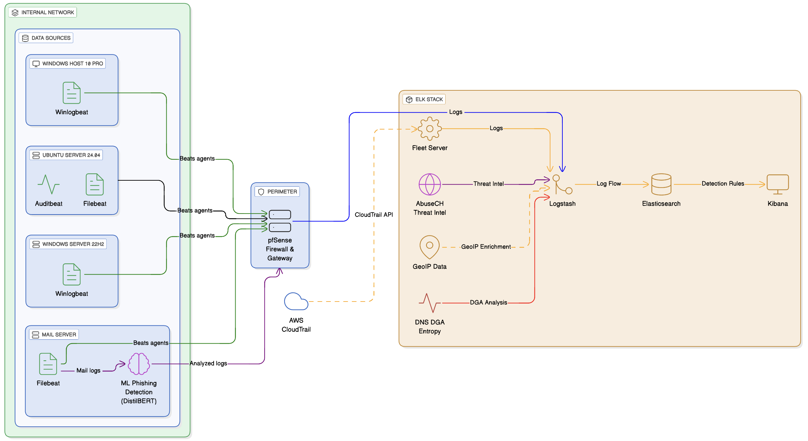
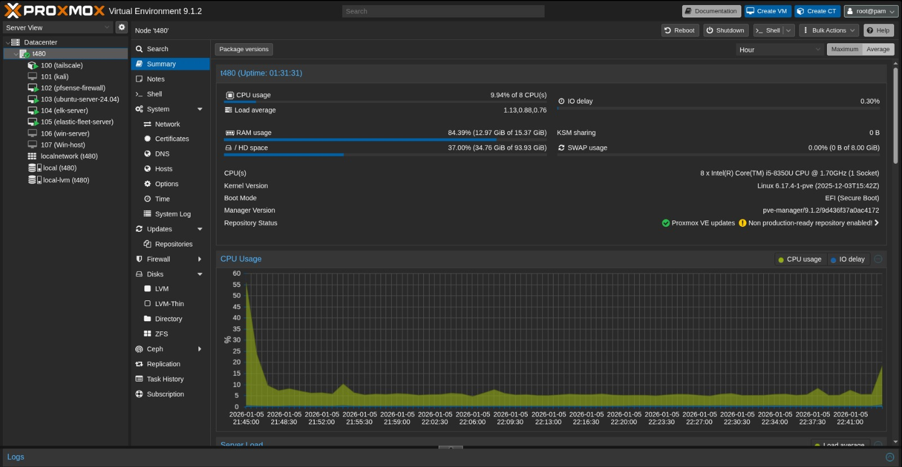
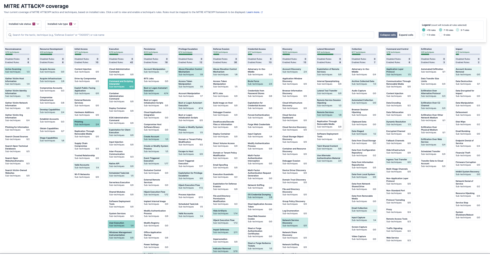

# Architecture and Data Flow

This document describes the adAPT architecture — a simulated enterprise environment for APT detection and threat hunting.

---

## Infrastructure Overview

The setup runs on a **Proxmox hypervisor** hosting multiple VMs that simulate an enterprise network environment, with all log sources behind a pfSense firewall gateway to mimic real-world segmentation.

### Proxmox Setup

---

## Log Sources

| Source | Agent/Method | Log Types |
|--------|--------------|-----------|
| Windows 10 Pro | Winlogbeat | Security, Sysmon, PowerShell events |
| Windows Server 22H2 | Winlogbeat | Security, Sysmon, PowerShell, process logs |
| Ubuntu Server 24.04 | Auditbeat, Filebeat, Zeek | System logs, auditd, auth logs, network traffic (DNS, HTTP, SSL, conn) |
| pfSense Firewall | Syslog → Filebeat | Firewall allow/block, NAT, gateway logs |
| Mail Server | Filebeat + ML API | Mail logs enriched with phishing score/label |
| AWS | CloudTrail integration | CloudTrail audit logs |

---

## ELK Stack Components

### Logstash — Ingest Pipelines
Multiple pipelines handle log parsing and enrichment (see `/logstash/`):
- **Beats Input** — Receives logs from Winlogbeat, Filebeat, Auditbeat
- **ECS Normalization** — Standardizes fields to Elastic Common Schema
- **GeoIP Enrichment** — Adds geographic data and ASN info to external IPs
- **Threat Intelligence** — Abuse.ch feeds (URLhaus, MalwareBazaar, SSL Blacklist, JA3)
- **Index Routing** — Routes logs to appropriate indices (winlogbeat, pfsense, zeek, ubuntu-system, ubuntu-auditd, filebeat)

### Elasticsearch — Storage & Detection Engine
- Centralized log storage and indexing
- Detection rule execution (KQL/EQL queries)
- Threat intel indicator matching

### Kibana — Security Interface
- **Dashboards** — Visualizations for network traffic, authentication, threats
- **Detection Rules** — 100+ MITRE-mapped rules in KQL and EQL
- **Alerts** — Real-time alerting on rule matches
- **Timeline** — Investigation and threat hunting interface

---

## Detection Rules

Detection rules are stored in `/sigma_rules/` and cover:

### MITRE ATT&CK Coverage
| Tactic | Techniques | Example Rules |
|--------|------------|---------------|
| Initial Access | T1190, T1078, T1566 | Phishing email detection, SSH brute force, macro-enabled downloads |
| Execution | T1059, T1204, T1218 | Encoded commands, macro execution, mshta abuse, rundll32 |
| Persistence | T1547, T1053, T1543, T1542 | Scheduled tasks, registry run keys, services, bootkit |
| Privilege Escalation | T1055, T1548, T1068 | Process injection, UAC bypass, sudo exploits, wildcard injection |
| Defense Evasion | T1027, T1070, T1036, T1562, T1564 | Encoded payloads, log clearing, masquerading, hidden files |
| Credential Access | T1003, T1110 | Credential dumping, password spraying, minidump |
| Discovery | T1016, T1018, T1033, T1069, T1087 | Network scanning, ARP enumeration, account discovery |
| Lateral Movement | T1021, T1550 | Remote services, pass-the-hash |
| Collection | T1005, T1074, T1560 | Data from local system, staging, compression |
| Exfiltration | T1041, T1048 | DNS tunneling, staged data exfil |
| Impact | T1490, T1531 | Shadow copy deletion, account access removal |

### Attack Chain Detection (EQL Sequences)
- **APT-36** — Windows attack chain: macro-enabled downloads → command shell spawns → keyboard simulation → encoded PowerShell → registry persistence → LNK file staging
- **APT-41** — Multi-stage Windows intrusion chain with lateral movement and credential access
- **Data Exfiltration Chain (Thief)** — Linux attack chain: staging directory creation → sensitive file discovery → data compression → exfiltration (T1074 → T1005 → T1560 → T1041)

### Threat Intelligence Rules
- JA3 fingerprint matching (Qakbot, malware C2)
- MalwareBazaar file hash matching
- URLhaus malicious URL detection
- SSL blacklist certificate detection

---

